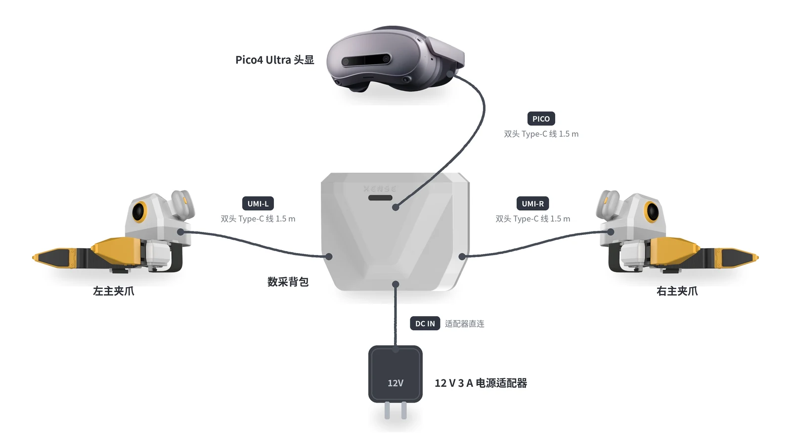
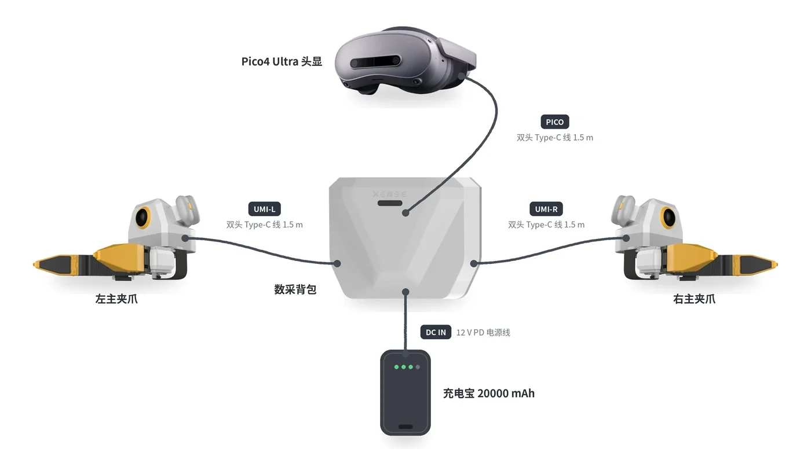

# 产品线与配置对比

XTac-UMI 提供两种配置，使用同一套 XTac-UMI G1 夹爪与 Pico4 Ultra 企业版头显，采集到的数据定义一致：

- **背包版**：数采背包完成全部采集，平板浏览器即控制台，开箱即用，适合规模化现场采集；采集软件不开源。
- **PC 版（开源）**：夹爪与头显直连您的工作站，基于开源 LeRobot 录制，适合科研与算法团队自由二次开发。

本页对比两者的差别，并列出各自的箱内清单与接线方式。

-   { .xu-card__img }

    背包版

    **XTac-UMI 数采背包**{ .xu-card__title }

    ---

    背包即主机、平板即控制台，夹爪按键录制，数据一键发布到 ModelScope。

    [快速开始](../backpack/quickstart.md){ .md-button .md-button--primary }

-   { .xu-card__img }

    PC 版

    **XTac-UMI G1 开发套件（开源）**{ .xu-card__title }

    ---

    直连您的工作站，基于开源 LeRobot 录制，采集软件与夹爪 SDK 均开源。

    [快速开始](../pc/quickstart.md){ .md-button .md-button--primary }

## 两种配置的差别

| | 背包版 · XTac-UMI 数采背包 | PC 版 · XTac-UMI G1 开发套件 |
|---|---|---|
| 计算 | 随机附带的数采背包 | 自备 x86 工作站，建议配 NVIDIA 显卡 |
| 操作界面 | 浏览器控制台，平板即可 | 终端命令 + Rerun 预览窗口 |
| 头显连接 | Type-C 线接背包，只能有线 | Type-C 线接工作站，默认有线 |
| 录制控制 | 夹爪按键为主，控制台也可操作 | `lerobot-record` 命令行 |
| 采集模式 | 双爪，可加头显双目或右单目画面 | 单爪 / 双爪，可加头显画面 |
| 落盘格式 | 每条人类示范一个 MCAP 原始记录 | 直接写 LeRobotDataset v3 |
| 导出与上传 | 按任务导出 LeRobot v3 / MCAP，下载或上传到 ModelScope、S3、FTP、NFS 等 | 推送到 Hugging Face Hub |
| 升级 | 控制台导入升级包，可回滚 | 更新仓库或镜像 |
| 二次开发 | 不开源；基于导出数据定制 | 开源（Apache-2.0），可改代码、接自定义机器人 |
| 适合谁 | 规模化数采工厂与现场采集团队 | 科研与算法团队、自建训练流程 |

## 箱内清单与接线 {#kit}

=== "背包版"

    | 物品 | 数量 | 规格与说明 |
    |---|---|---|
    | XTac-UMI G1 主夹爪 | 2 | 左右各一，按序列号末位区分：单数左、双数右 |
    | 主夹爪连接线 | 2 | 双 Type-C，1.5 m，左右各一；夹爪端为锁紧接头，另一端接背包 `UMI-L` / `UMI-R` |
    | Pico4 Ultra 企业版头显 | 1 | 含手柄与运动追踪器，追踪器装在两只主夹爪顶部 |
    | 追踪器充电底座 | 1 | 一拖三 |
    | 头显连接线（Pico → Pack） | 1 | 双 Type-C，1.5 m，头显接背包 `PICO` 口 |
    | 数采背包 | 1 | 计算节点，常开 5 GHz 热点 |
    | 腰带组件 | 1 | 佩戴数采背包 |
    | 12 V 电源适配器 | 1 | 12 V 3 A，线长 1.5 m，接背包 `DC` 口 |
    | 充电宝 | 1 | 20000 mAh，45 W |
    | 12 V PD 电源线 | 1 | 0.3 m，充电宝接背包 `DC` 口 |
    | 平板电脑 | 1 | 6 GB + 128 GB，含保护套，作为控制台 |
    | Type-C 充电插头 | 1 | PD 快充，100 W |

    固定工位用适配器供电，移动采集用充电宝供电：

    === "适配器供电（固定工位）"

        

    === "充电宝供电（移动采集）"

        

    接线步骤见[适配器供电](../backpack/unbox-connect.md#adapter)与[充电宝供电](../backpack/unbox-connect.md#powerbank)；供电与拔线顺序的安全要求见[数采背包与供电](safety.md#backpack-power)；连上背包、打开控制台见[背包热点](../backpack/network.md#softap)。

=== "PC 版"

    | 物品 | 数量 | 规格与说明 |
    |---|---|---|
    | XTac-UMI G1 主夹爪 | 2 | 左右各一，按序列号末位区分：单数左、双数右 |
    | 主夹爪连接线 | 2 | Type-C 转 Type-A，USB 2.0，3 m；夹爪端为锁紧接头 |
    | Pico4 Ultra 企业版头显 | 1 | 含手柄与运动追踪器，追踪器装在两只主夹爪顶部 |
    | 追踪器充电底座 | 1 | 一拖三 |
    | 头显连接线 | 1 | 双头 Type-C，1.5 m，头显接主机 |

    选配从夹爪时另附：

    | 物品 | 数量 | 规格与说明 |
    |---|---|---|
    | XTac-UMI G1 从夹爪 | 2 | 左右各一，装在机器人末端 |
    | 24 V 电源适配器 | 2 | 24 V 2.5 A，线长 4.5 m，带磁环，每只从夹爪一个 |
    | 束线带 | 1 | 3 m，沿机械臂整理线缆 |

    主机自备，配置要求见[采集主机配置要求](../pc/install.md#host-spec)。一共 3 条线：

    - **主夹爪 × 2**：Type-C 转 USB-A 线，左右各一条接主机的 USB-A 口；两只夹爪要分挂两条 USB 总线，见 [USB 带宽预算](../pc/host-setup.md#usb-budget)。
    - **头显 × 1**：双头 Type-C 线接主机，走有线共享网络，见[网络连接](../common/pico4.md#pico-network)。

    上电顺序与第一次采集见 [PC 版一页速通](../pc/quickstart.md#power-on)。

## 常见问题

??? question "两种配置采的数据能混在一起训练吗"

    可以。两边导出的都是 LeRobotDataset v3，同一套 LeRobot 工具都能读；相机键名与字段布局略有不同，合并前对照各自的 `meta/info.json`。

??? question "背包版能二次开发吗"

    只能轻量定制：采集软件不开源，可以基于导出的数据、上传配置与采集设置做定制。要改采集逻辑或接自己的机器人，选开源的 PC 版。

??? question "PC 版一定要 NVIDIA 显卡吗"

    正式采集建议配 NVIDIA 显卡，配置见[主机配置要求](../pc/install.md#host-spec)。没有显卡也能录，但存盘慢、容易掉帧，见[没有 NVIDIA GPU 的主机怎么录](../pc/recording.md#no-gpu)。

??? question "头显是必需的吗"

    背包版必需，所有采集模式都要靠头显和追踪器提供位姿。PC 版只录夹爪数据（触觉、腕部画面、开合度）时可以不用头显。

??? question "手机能当背包版的控制台吗"

    可以，平板、手机、电脑都只用浏览器打开控制台，连接方法见[网络与控制台入口](../backpack/network.md)。

??? question "背包版需要联网吗"

    采集不需要，背包自带热点。只有上传到远端时才要联网：传 ModelScope、S3 要能上外网，传局域网里的 FTP / NFS 连上同一局域网即可。

## 开始使用与售后

- **开始使用**：背包版见[一页速通](../backpack/quickstart.md)，PC 版见[一页速通](../pc/quickstart.md)。
- **开箱缺件或配件损坏**：请联系售后团队补发，不要用其他线缆或电源替代。
- **使用中遇到问题**：先查对应版本的故障排查，仍未解决请联系售后团队，并按[支持与反馈](../common/reference.md#support)附上设备序列号与日志。
