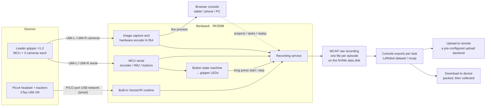
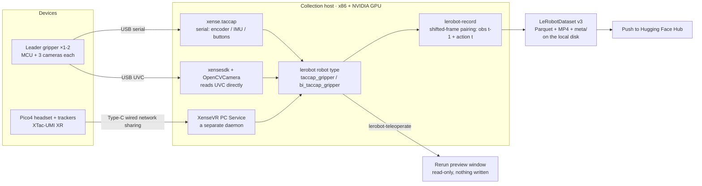

# XTac-UMI G1

XTac-UMI G1 is XenseRobotics' handheld UMI data-collection gripper for robot manipulation learning. The leader gripper integrates two visuotactile sensors, a wrist fisheye camera, an encoder and an IMU, and together with a Pico4 Ultra tracker it captures RGB, tactile images, 6-DoF pose and gripper opening in sync; the follower gripper mounts on a robot's end effector for execution or replay. This page covers three things: which parts make up the collection system, what the data passes through on its way from sensor to dataset, and from which step the two configurations differ.

{ width="720" }

During collection the **motor is not driven** (it is never energised): the operator holds the leader gripper and performs the demonstration mechanically, so there is no separate teleoperation end. The same grippers and headset can feed either collection unit: [the backpack](backpack.md) (the Backpack Kit, with the console in a browser) or your own x86 workstation (the Developer Kit, running entirely on the LeRobot framework). The trade-off is in [Product line and configuration comparison](editions.md).

## What the collection system is made of

| Part | What it is | Rate / connection | In the two configurations |
|---|---|---|---|
| Leader gripper (left and right differ) | The human-side operation and collection end; the main MCU is an STM32. Left and right are told apart by their markings, and the buttons and LEDs are in [Gripper buttons, LEDs and serial numbers](../common/gripper.md) | USB Type-C for both power and communication | The same; the buttons and LED patterns are driven by the collection unit, and the Backpack Kit has a complete button state machine |
| Follower gripper (no left / right) | Mounts on a robot's end effector, with a motor jaw, for execution-end operation or replay | 24 V power + Type-C communication | The same, optional |
| Encoder | The gripper's opening angle; after calibration it is normalised to 0 closed and 1 fully open, and the real travel differs from unit to unit | 100 Hz | The same; the calibration entry point differs — the Backpack Kit uses the console's System → Gripper page, and the Developer Kit uses [Gripper calibration](../pc/calibration.md#41) |
| IMU | Acceleration / angular rate / magnetic field / temperature | 100 Hz | The same |
| Visuotactile sensors ×2 | One per finger, tri-colour visuotactile imaging; about `(400, 700, 3)` after rectification | 120 Hz at the sensor, UVC | The same; the Backpack Kit records at 120 fps and the Developer Kit records at 30 fps by default |
| Wrist fisheye camera | RGB from the wrist's viewpoint, with a very wide field of view | ~30 Hz, UVC | The same |
| Pico4 Ultra motion tracker | Fitted on top of the leader gripper, connected wirelessly to the headset | — | The same |
| Pico4 Ultra Enterprise headset | Pairs the trackers, establishes the world frame, and sends the 6-DoF pose to the collection unit over Type-C (wired by default, WiFi only for quick debugging); setup is in [Pico4 headset and tracker setup](../common/pico4.md) | — | The same; only the connection differs — the Backpack Kit uses the backpack's `PICO` port and the Developer Kit uses the collection host, see [Network connection](../common/pico4.md#pico-network) |
| Collection unit | Backpack Kit: the backpack (an RK3588 compute node) + XTac-UMI Collector. Developer Kit: an x86 collection host + `xense-taccap-lerobot`. Everything downstream of the collection unit is completely different, see the next section | — | Different |

Cables, power adapters, collection terminals and the like follow the contract configuration and the packing list; if something is missing, contact your project manager or technical support rather than substituting it yourself. The platforms and dependency versions the Developer Kit supports are in [You must upgrade to the latest versions](../pc/versions.md#required).

## System architecture and data flow

The sensor side is identical in both configurations: each leader gripper produces one MCU serial stream (encoder, IMU, buttons) and three UVC image streams (one wrist fisheye plus two visuotactile), and the Pico4 headset feeds in the 6-DoF pose. **Downstream of the collection unit there are two independent software stacks**, differing in the on-disk format, the preview and the recording control, so they are covered separately below.

### Backpack Kit: XTac-UMI Collector

Once data reaches the backpack, the collection software handles all of it: images are hardware-encoded on the backpack, and one encode serves both the preview and the recording. Recording is triggered by the gripper buttons and the result is written as an MCAP raw recording. **The raw recording is the source format, and everything you hand out is exported offline per task**: `LeRobot dataset` and `mcap` are two equal, non-exclusive formats, and at export you pick the destination first (download to the device and collect an archive, or upload to a remote backend configured beforehand) and then the format.

The details are in [Live monitor and recording](../backpack/monitor-record.md) and [Projects, export and publishing](../backpack/projects-export.md).

### Developer Kit: xense-taccap-lerobot

A Python process on the host reads the data in over three paths, aggregates it into a lerobot robot type, and `lerobot-record` writes the dataset directly. **The training format is the on-disk format; there is no intermediate raw recording.**

The details are in [How collection works](../pc/recording.md#51) and [Datasets](../pc/dataset.md#61).

### The key differences between the two paths

| | Backpack Kit | Developer Kit |
|---|---|---|
| Device access | Handled inside Collector, with no SDK to install | `xense.taccap` reads the MCU, `xensesdk` reads the tactile sensors, `xensevr_pc_service_sdk` reads the pose |
| Pose service | The XenseVR runtime is built in and starts with the backpack | XenseVR PC Service is a separate daemon, started before the app; from v0.2.0 it also forwards the [headset stereo views](../pc/recording.md#56) |
| Image encoding | RK3588 hardware H.264 encoding, encoded once and served to both preview and recording | Streaming encoding on the host GPU, with preview and recording going their own way |
| Preview | The live views in the browser console | The Rerun window opened by `lerobot-teleoperate` |
| Recording control | Mainly the gripper buttons, with LED feedback; the console can do it too | `lerobot-record` command-line arguments |
| On-disk format | MCAP raw recordings (one file per episode), with LeRobot as an offline export | LeRobotDataset v3 written directly |
| How data gets out | Task-level export: download an archive, or upload to a pre-configured remote backend | Pushed to the Hugging Face Hub |

What is the same in both: camera data never goes through the gripper MCU (the wrist camera and the tactile sensors are UVC devices that the collection unit reads directly), and every frame records the end-effector TCP pose, the normalised opening, the IMU, the left and right tactile images and the wrist camera image. The field names follow each collection unit — the Developer Kit's are in [What each frame holds](../pc/recording.md#53) — and the frame the poses live in is the same on both sides, see [Coordinate frames](../common/coordinates.md).

## Next

- Wiring, buttons, LEDs and serial numbers: [Gripper buttons, LEDs and serial numbers](../common/gripper.md)
- Dimensions, weight, sensors and the backpack's connectors: [Technical specifications](specs.md)
- Power and operational safety requirements: [Safety and compliance](safety.md)
