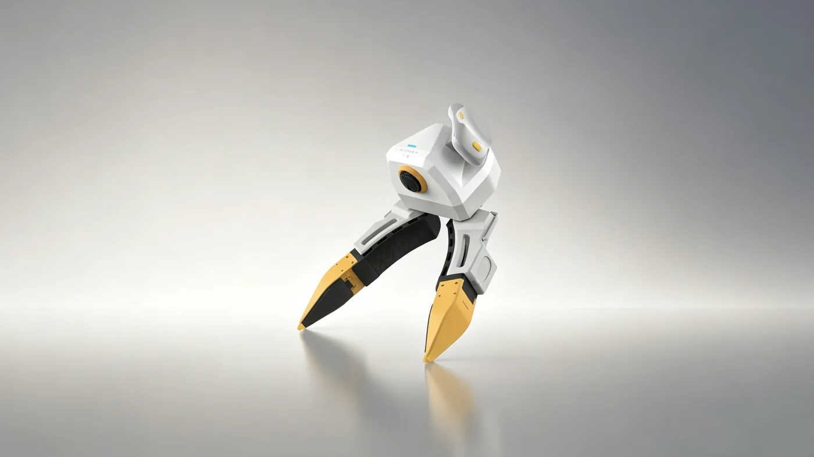

# XTac-UMI G1

XTac-UMI G1 is Xense's multimodal UMI data-collection gripper: the operator demonstrates with the leader gripper in hand while fingertip visuotactile sensing, the wrist fisheye and pose are recorded in sync; the follower gripper mounts on a robot to execute or replay motions.

{ width="720" }

## System components

| Part | Role |
|---|---|
| Leader grippers ×2 (left / right) | Handheld demonstration; each carries two visuotactile sensors, a wrist fisheye camera, an opening encoder and an IMU, see [Gripper connection and serial numbers](../common/gripper.md) |
| Pico4 Ultra motion trackers ×2 | Mounted on top of the leader grippers, giving their 6-DoF pose |
| Pico4 Ultra Enterprise headset | Tracks the trackers and sets the world frame; can also record a first-person stereo view, see [Pico4 headset and trackers](../common/pico4.md) |
| Collection unit | The [backpack](backpack.md) on the Backpack Kit, your own workstation on the Developer Kit, see [Editions](editions.md) |
| Follower grippers (optional) | Mounted on a robot to execute or replay motions, see [Follower gripper](../follower/index.md) |

Specifications are in [Specifications](specs.md).

## Data flow {#dataflow}

The sensor side is identical in both kits; they differ from the collection unit on. Hover over (or tap) any block to see where its data comes from and where it goes.

### Backpack Kit {#dataflow-backpack}

Recording is controlled by gripper button gestures; the gesture table is in [Buttons](../backpack/gripper.md#buttons).

### Developer Kit {#dataflow-pc}

## Key differences between the kits

| | Backpack Kit | Developer Kit |
|---|---|---|
| Preview | Browser console, a tablet is enough | Rerun window |
| Recording control | Mainly the gripper buttons; the console works too | `lerobot-record` command line |
| On disk | One MCAP raw recording per take | LeRobotDataset v3 directly |
| Data out | Export per task as LeRobot v3 / MCAP, upload to ModelScope in one click | Push to the Hugging Face Hub |
| Open source | No | Yes (Apache-2.0) |

Both kits record poses in the same coordinate frame, see [Coordinate frames](../common/coordinates.md). The full comparison, box contents and wiring are in [Editions](editions.md).

## Next steps

- Wiring and serial numbers: [Gripper connection and serial numbers](../common/gripper.md); the Backpack Kit's buttons and LEDs: [Gripper buttons, LEDs and voice](../backpack/gripper.md)
- Size, weight, sensors and backpack ports: [Specifications](specs.md)
- Power and operating safety: [Safety and compliance](safety.md)
