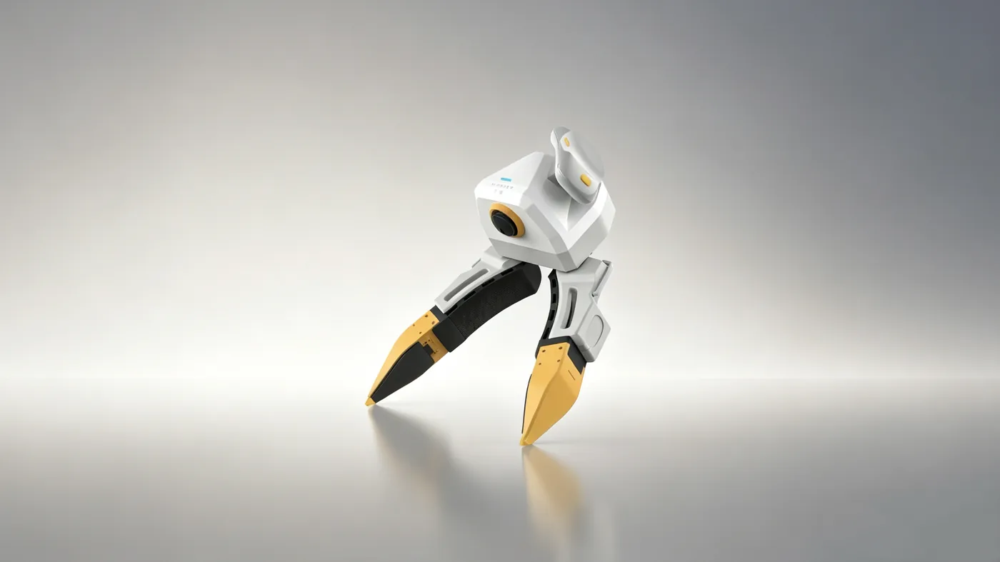
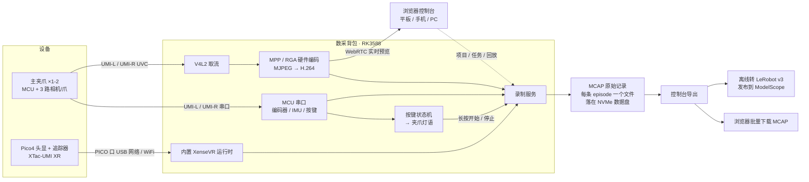
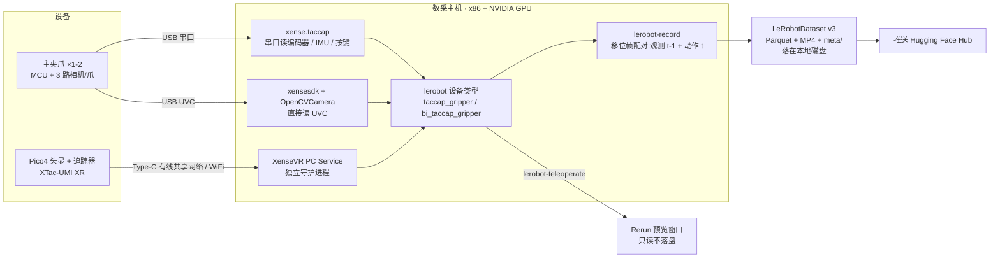

# 认识 XTac-UMI G1

XTac-UMI G1 是千觉机器人面向机器人操作学习的手持式 UMI 数采夹爪:主夹爪集成双视触觉传感器、腕部鱼眼相机、编码器与 IMU,配合 Pico4 Ultra 追踪器同步采集 RGB、触觉图像、6-DoF 位姿与夹爪开度;从夹爪装在机器人末端,用于执行或回放。本页帮你认清各部件、看懂数据从传感器到数据集怎么流,以及哪些部件在背包版与 PC 版里相同、哪些不同。

{ width="720" }

采集时**不驱动电机**(电机始终不使能),操作员手持主夹爪机械地完成演示动作,因此没有独立遥操作端。同一套夹爪与头显可以接两种采集单元:[数采背包](backpack.md)(背包版,控制台在浏览器里)或你自己的 x86 工作站(PC 版,完全走 LeRobot 框架),两种配置的取舍见[产品线与配置对比](editions.md)。

## 数采系统组成

| 部件 | 说明 | 采样率 / 连接 | 两种形态 |
|---|---|---|---|
| 主夹爪 (区分左右) | 人手侧操作与采集;主控 MCU 为 STM32;左右按标识区分,按键与指示灯见[夹爪按键、指示灯与序列号](../common/gripper.md) | USB Type-C 统一供电 + 通信 | 相同;按键与灯语由采集单元决定,背包版有完整的按键状态机 |
| 从夹爪 (不区分左右) | 装在机器人末端,带电机夹爪(motor jaw),用于执行端操作或回放 | 24V 供电 + Type-C 通信 | 相同,可选 |
| 编码器 | 夹爪开合角度;标定后归一化为闭合 = 0、张开 = 1,真实行程每台各异 | 100 Hz | 相同;标定入口不同:背包版在控制台 系统 → 夹爪配置,PC 版见[夹爪标定](../pc/calibration.md#41) |
| IMU | 加速度 / 角速度 / 磁力 / 温度 | 100 Hz | 相同 |
| 视触觉传感器 ×2 | 左右指各一,三色光视触觉成像;校正后约 `(400, 700, 3)` | 传感器 120 Hz,UVC | 相同;背包版按 120 fps 记录,PC 版默认按 30 fps 录制 |
| 腕部鱼眼相机 | 手腕视角 RGB,超大视场角 | ~30 Hz,UVC | 相同 |
| Pico4 Ultra 运动追踪器 | 装在主夹爪顶部,无线连头显 | — | 相同 |
| Pico4 Ultra 企业版头显 | 配对追踪器、建立世界坐标系,经 Type-C 有线或 WiFi 把 6-DoF 位姿送到采集单元;配置见 [Pico4 头显与追踪器配置](../common/pico4.md) | — | 相同;只有接法不同,背包版接背包 `PICO` 口,PC 版接数采主机,见[网络连接](../common/pico4.md#pico-network) |
| 采集单元 | 背包版:数采背包(RK3588 计算节点)+ XTac-UMI Collector;PC 版:x86 数采主机 + `xense-taccap-lerobot`。采集单元往后的软件栈两边完全不同,见下节 | — | 不同 |

线缆、电源适配器、采集终端等以合同配置及随货清单为准,缺件时联系项目负责人或技术支持,勿自行替代。PC 版支持的平台与依赖版本见[必须升级到最新版本](../pc/versions.md#required)。

## 系统架构与数据流

传感器侧两种形态完全一样:每只主夹爪出一路 MCU 串口(编码器、IMU、按键)和三路 UVC 图像(1 路腕部鱼眼 + 2 路视触觉),Pico4 头显把 6-DoF 位姿送进来。**采集单元往后是两套独立的软件栈**,落盘格式、预览方式和录制控制都不同,下面分开看。

### 背包版:XTac-UMI Collector

数据进背包后由一个 Rust 服务统一处理:图像走 RK3588 的硬件编码,一次编码分别用于预览和落盘;录制由夹爪按键触发,结果写成 MCAP 原始记录。**MCAP 是源格式,LeRobot 是离线导出的产物。**

细节见[实时监控与录制](../backpack/monitor-record.md)与[项目、导出与发布](../backpack/projects-export.md)。

### PC 版:xense-taccap-lerobot

数据由主机上的 Python 进程分三路读入,聚合成 lerobot 的设备类型,再由 `lerobot-record` 直接写出数据集。**训练格式就是落盘格式,没有中间的原始记录。**

细节见[采集原理](../pc/recording.md#51)与[数据集](../pc/dataset.md#61)。

### 两条链路的关键差别

| | 背包版 | PC 版 |
|---|---|---|
| 设备访问 | Collector 内部完成,不用装 SDK | `xense.taccap` 读 MCU、`xensesdk` 读触觉、`xensevr_pc_service_sdk` 读位姿 |
| 位姿服务 | XenseVR 运行时内置,随背包启动 | XenseVR PC Service 是独立守护进程,要先起服务再开 App;≥ v0.2.0 还转发[头显双目画面](../pc/recording.md#56) |
| 图像编码 | RK3588 硬件编码 H.264,编码一次分发给预览与录制 | 主机 GPU 流式编码,预览与录制各走各的 |
| 预览 | 控制台里的 WebRTC 画面 | `lerobot-teleoperate` 打开的 Rerun 窗口 |
| 录制控制 | 夹爪按键为主,灯语反馈,控制台也能操作 | `lerobot-record` 命令行参数 |
| 落盘格式 | MCAP 原始记录(每条 episode 一个文件),LeRobot 是离线导出 | 直接写 LeRobotDataset v3 |
| 数据出口 | 浏览器下载 MCAP,或发布到 ModelScope | 推送到 Hugging Face Hub |

两种形态相同的是:相机数据都不经过夹爪 MCU(腕相机与触觉都是 UVC 设备,采集单元直接读),每帧都记录末端 TCP 位姿、归一化开度、IMU、左右触觉图与腕相机图。字段名以各自的采集单元为准,PC 版见[每帧记录内容](../pc/recording.md#53);位姿所在的坐标系两边一致,见[坐标系](../common/coordinates.md)。

## 下一步

- 接线、按键、指示灯与序列号:[夹爪按键、指示灯与序列号](../common/gripper.md)
- 尺寸、重量、传感器与背包接口:[技术参数](specs.md)
- 供电与操作安全要求:[安全与合规](safety.md)
