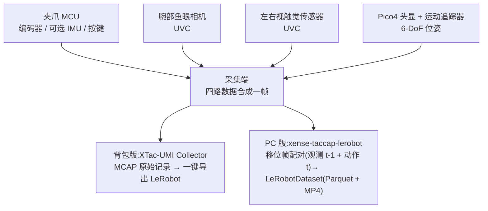

# 认识 XTac-UMI G1

XTac-UMI G1 是 XenseRobotics 面向机器人操作学习的手持式 UMI 数采夹爪:主夹爪集成双视触觉传感器、腕部鱼眼相机、编码器与 IMU,配合 Pico4 Ultra 追踪器同步采集 RGB、触觉图像、6-DoF 位姿与夹爪开度;从夹爪装在机器人末端,用于执行或回放。本页帮你认清各部件、看懂数据从传感器到数据集怎么流,以及哪些部件在背包版与 PC 版里相同、哪些不同。

{ width="720" }

采集时**不驱动电机**(电机始终不使能),操作员手持主夹爪机械地完成演示动作,因此没有独立遥操作端。同一套夹爪与头显可以接两种采集端:[数采背包](backpack.md)(背包版,控制台在浏览器里)或你自己的 x86 工作站(PC 版,完全走 LeRobot 框架),两种配置的取舍见[产品线与配置对比](editions.md)。

## 数采系统组成

| 部件 | 说明 | 采样率 / 连接 | 两种形态 |
|---|---|---|---|
| 主夹爪(区分左右) | 人手侧操作与采集;主控 MCU 为 STM32;左右按标识区分,按键与指示灯见[夹爪按键、指示灯与序列号](../common/gripper.md) | USB Type-C 统一供电 + 通信 | 相同;按键与灯语由采集端决定,背包版有完整的按键状态机 |
| 从夹爪(不区分左右) | 装在机器人末端,带电机夹爪(motor jaw),用于执行端操作或回放 | 24V 供电 + Type-C 通信 | 相同,可选 |
| 编码器(每只夹爪) | 夹爪开合角度;标定后归一化为闭合 = 0、张开 = 1,真实行程每台各异 | 100 Hz | 相同;标定入口不同:背包版在控制台 系统 → 夹爪配置,PC 版见[夹爪标定](../pc/calibration.md#41) |
| IMU(每只夹爪) | 加速度 / 角速度 / 磁力 / 温度 | 100 Hz | 相同 |
| 视触觉传感器 ×2(GSPS,每只夹爪) | 左右指各一,三色光视触觉成像;校正后约 `(400, 700, 3)` | 传感器 120 Hz,UVC | 相同;背包版按 120 fps 记录,PC 版默认按 30 fps 录制 |
| 腕部鱼眼相机(XC,每只夹爪) | 手腕视角 RGB,超大视场角 | ~30 Hz,UVC | 相同 |
| Pico4 Ultra 运动追踪器 | 装在主夹爪顶部,无线连头显 | — | 相同 |
| Pico4 Ultra 企业版头显 | 配对追踪器、建立世界坐标系,经 Type-C 有线或 WiFi 把 6-DoF 位姿送到采集端;配置见 [Pico4 头显与追踪器配置](../common/pico4.md) | — | 相同;只有接法不同,背包版接背包 `PICO` 口,PC 版接数采主机,见[网络连接](../common/pico4.md#pico-network) |
| 采集端 | 背包版:数采背包(RK3588 计算节点)+ XTac-UMI Collector;PC 版:x86 数采主机 + `xense-taccap-lerobot` | — | 不同 |
| 位姿服务 | 背包版:XenseVR 运行时内置在 Collector 里;PC 版:XenseVR PC Service 守护进程,可选转发头显双目画面(需服务 ≥ v0.2.0,见[头显相机](../pc/recording.md#56)) | — | 不同 |
| 设备访问层 | `xense.taccap` 经串口读 MCU 的编码器、IMU 与按键,`xensesdk` 读触觉图像 | — | PC 版;背包版由 Collector 内部完成 |
| 控制界面 | 背包版:浏览器控制台,平板、手机、电脑都能开;PC 版:命令行 + Rerun 预览 | — | 不同 |
| 输出 | 背包版:每条 episode 一个 MCAP 原始记录,控制台一键导出 LeRobot;PC 版:`lerobot-record`(`taccap_gripper` 设备类型)直接写出 LeRobotDataset,见[采集原理](../pc/recording.md#51) | — | 不同 |

线缆、电源适配器、采集终端等以合同配置及随货清单为准,缺件时联系项目负责人或技术支持,勿自行替代。PC 版支持的平台与依赖版本见[必须升级到最新版本](../pc/versions.md#required)。

## 系统架构与数据流

四路数据先在采集端汇总成一帧,再按形态落盘:背包版由 Collector 写成 MCAP 原始记录,导出时转成 LeRobot 格式;PC 版由 `lerobot-record` 完成移位帧配对并直接写 LeRobotDataset:

相机数据不经过夹爪 MCU:腕相机与触觉图像都是 UVC 设备,采集端直接读,汇总时取各路最新图像,与夹爪状态、Pico4 位姿合成一帧。每帧记录末端 TCP 位姿、归一化开度、可选 IMU、左右触觉图与腕相机图;PC 版的字段名见[每帧记录内容](../pc/recording.md#53),位姿所在的坐标系见[坐标系](../common/coordinates.md)。

## 下一步

- 接线、按键、指示灯与序列号:[夹爪按键、指示灯与序列号](../common/gripper.md)
- 尺寸、重量、传感器与背包接口:[技术参数](specs.md)
- 供电与操作安全要求:[安全与合规](safety.md)
