# Highlights

**XTac-UMI G1** is a multimodal UMI data-collection gripper whose fingertips carry Xense's own **visuotactile sensors**, seeing exactly where, how hard and how stably every contact happens. A handheld demonstration records touch, vision and pose in sync, turning out high-quality robot manipulation data for imitation learning, VLA model training and tactile research.

<figure class="tc-video">
<video controls preload="none" playsinline poster="../../../assets/highlights/video-poster.webp">
<source src="../../../assets/video/xtac-umi-g1-market.mp4" type="video/mp4">
</video>
<figcaption>XTac-UMI G1 product video</figcaption>
</figure>

## Core value

-   :material-cash-minus: __Lower cost, shorter data path__

    ---

    Capture, synchronisation and tooling live in one system, turning human demonstrations straight into trainable data.

-   :material-hand-back-right-outline: __Natural handling, efficient collection__

    ---

    The wearable form follows the hand's own motion, is quick to learn, and suits long, multi-task sessions.

-   :material-fingerprint: __From "watchable" to "understandable" data__

    ---

    Beyond recording that "the hand moved", it tells whether, where and how stably contact happened.

-   :material-database-arrow-up-outline: __Traceable data at scale__

    ---

    Standardised output and fleet deployment; data is easy to review, compare and reuse.

## Six highlights

-   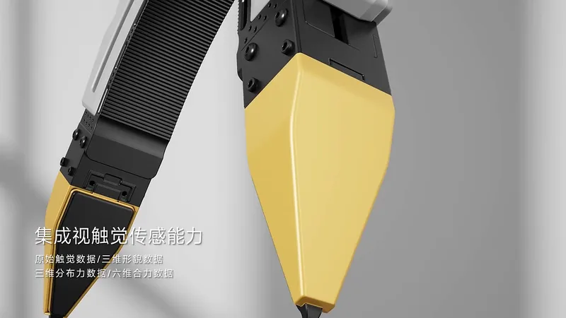{ .tc-card-img loading=lazy }

    :material-layers-triple-outline: __Visuotactile fusion, real interaction__

    ---

    High-frame-rate tri-colour visuotactile sensors record contact location, grasp stability and slip trends in sync.

-   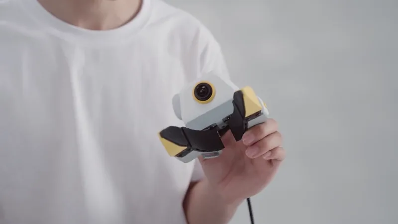{ .tc-card-img loading=lazy }

    :material-gesture-tap-hold: __Close to the human hand, faster collection__

    ---

    The wearable leader end is light and easy to pick up, covering grasping, carrying, insertion, thin-part picking and more.

-   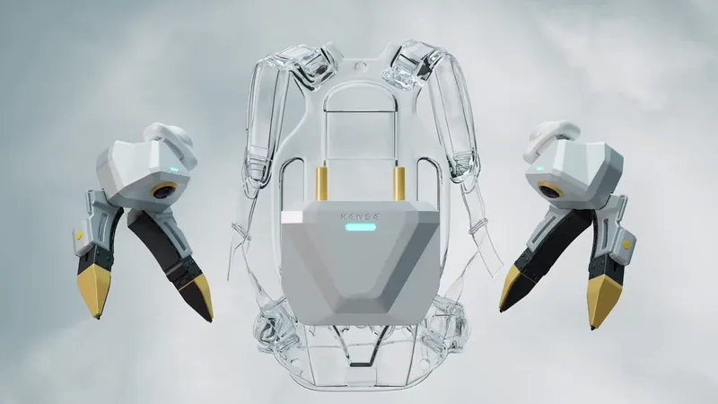{ .tc-card-img loading=lazy }

    :material-sync: __Precise, synchronised output__

    ---

    Multi-device time sync of **5ms** and positioning accuracy of **< 3mm**; every stream is aligned to the same instant.

-   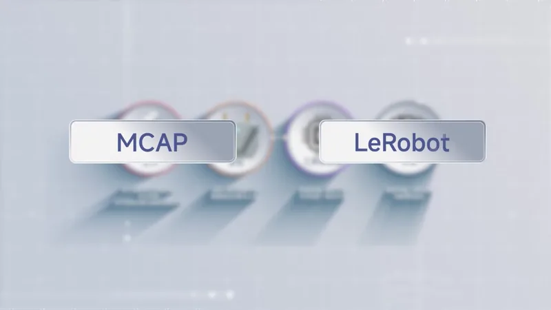{ .tc-card-img loading=lazy }

    :material-connection: __Mainstream ecosystem, data ready to use__

    ---

    Native support for **LeRobot, MCAP** and other mainstream formats and tools, so data is ready for training as soon as it is collected.

-   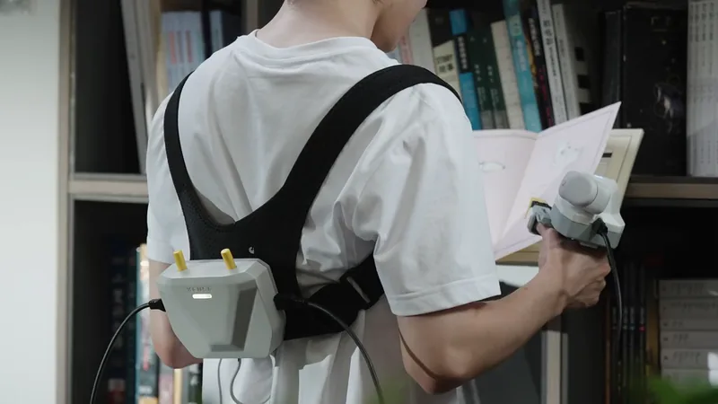{ .tc-card-img loading=lazy }

    :material-bag-personal-outline: __Light deployment, built for scale__

    ---

    A light leader end and a wearable collection unit, ready for the lab, home or field.

-   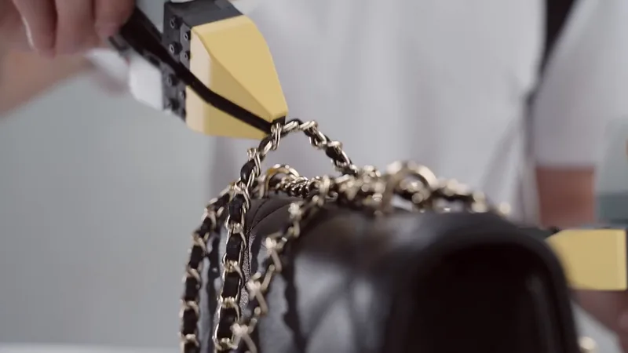{ .tc-card-img loading=lazy }

    :material-gesture-tap-button: __Compliant fingertips for fine grasping__

    ---

    Slim, compliant fingertips make small parts, thin sheets and edge-lying objects easier to pick up.

## Product appearance

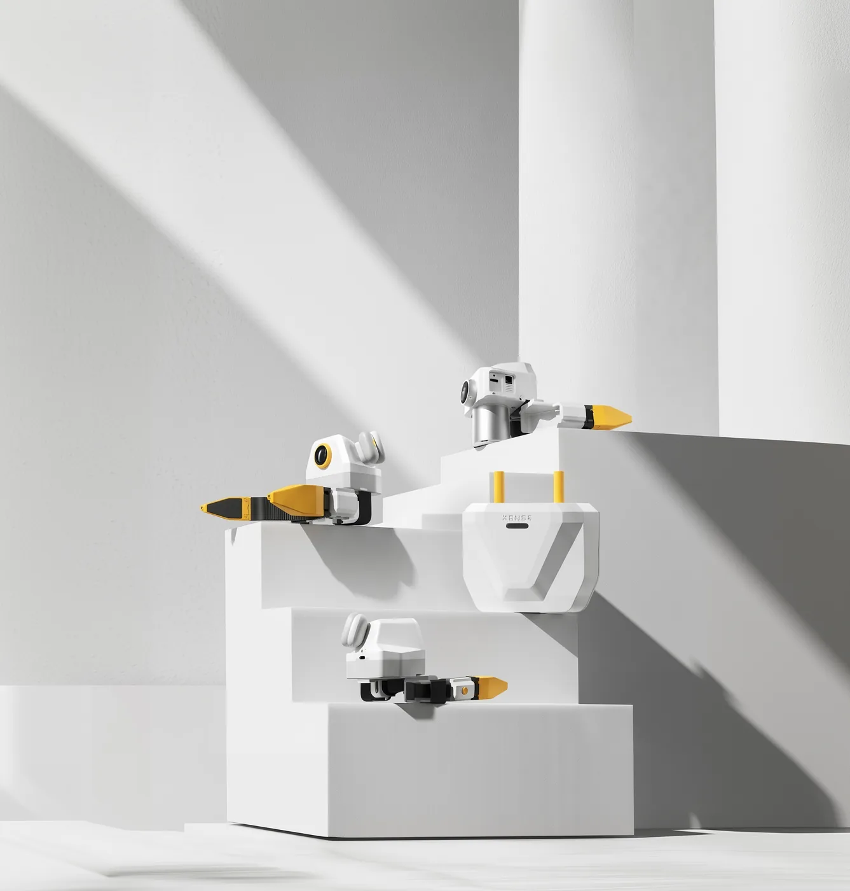{ width="560" }

=== "Leader gripper, five views"

    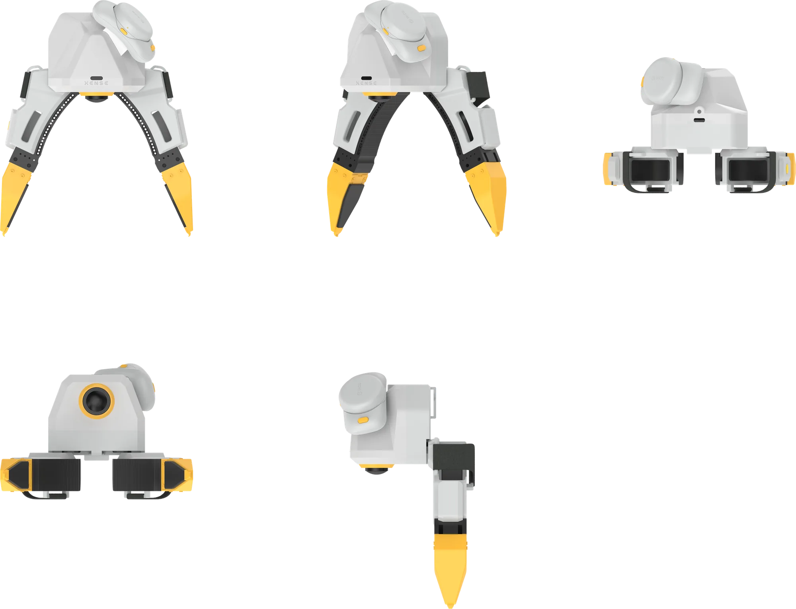{ width="720" }

=== "Follower gripper, five views"

    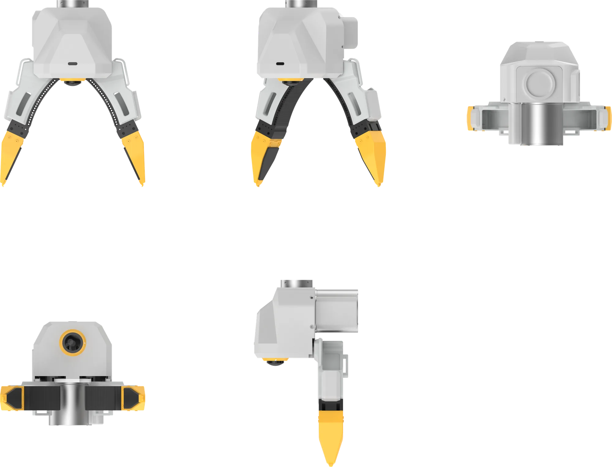{ width="720" }

## Applications

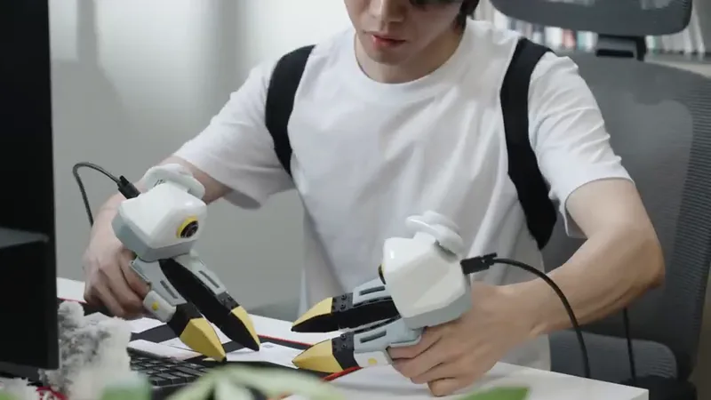{ loading=lazy }
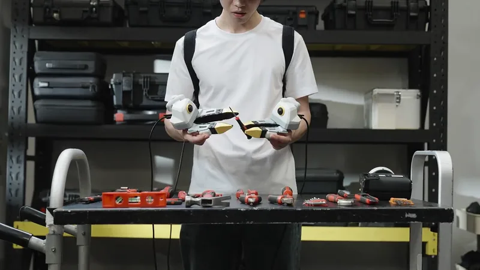{ loading=lazy }
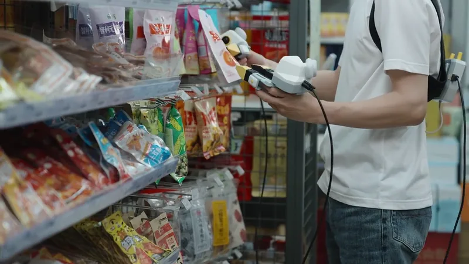{ loading=lazy }

- **Embodied-AI data factories**: large-scale manipulation data collection across many stations, operators and tasks.
- **Robot algorithm R&D**: a source of real interaction data for robotics companies, university labs and embodied-AI teams.
- **Home and service robots**: tidying desks, picking and placing items, opening containers, using tools.
- **Flexible industrial manipulation**: 3C assembly, small-part sorting, cable insertion, part picking.
- **Tactile and real-interaction research**: contact-state understanding, tactile representation and tactile foundation models.

!!! note "Full specifications"
    Product parameters are in [Specifications](specs.md#specs).
