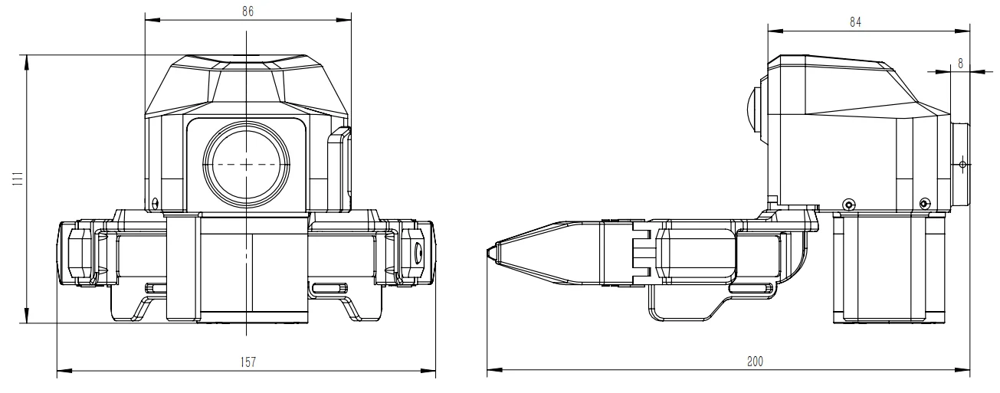

# 技术参数

XTac-UMI G1 夹爪、定位系统与数采背包的规格。接线见[夹爪连接与序列号](../common/gripper.md)，两种配置的取舍见[产品线与配置对比](editions.md)。

## 主夹爪 {#specs}

| 参数 | 规格 |
|---|---|
| 结构 | 二指夹爪，左右各一只 |
| 外形尺寸 | 145 × 186 × 170 mm |
| 重量 | 约 370 g |
| 负载 | 最大 2.5 kg |
| 开合行程 | 0–150 mm（每台以标定结果为准） |
| 视触觉传感器 | 2 个（左右指各一），参数见下方[视触觉传感器](#sensor) |
| 腕部鱼眼相机 | 视场角 190°，640 × 480 @ 30 fps |
| IMU | 9 轴，100 Hz |
| 开合编码器 | 100 Hz |
| 接口与供电 | USB Type-C（锁紧接头），DC 5V / 500 mA 总线供电，无内置电池 |
| 工作温度 | 0–50 °C |

### 视触觉传感器 {#sensor}

指尖传感器为千觉 GS-PS 视触觉传感器，详见[产品页](https://www.xenserobotics.com/product/367/detail/23)。

| 参数 | 规格 |
|---|---|
| 成像方式 | 三色光 |
| 传感面积 | 623 mm² |
| 柔性层厚度 | 2–5 mm |
| 图像分辨率 | 640 × 480 |
| 采样频率 | 0–120 Hz |
| 量程 | 0–25 N |
| 合力精度 | 0.2 N |
| 变形场精度 | 0.1 mm |
| 感知模态 | 三维形貌、六维合力、三维分布力、滑移检测 |

采集时的实际帧率可以按需设置（如 PC 版触觉默认以 30 fps 录制），不改变传感器本身的规格。

## 从夹爪 {#follower}

| 参数 | 规格 |
|---|---|
| 结构 | 二指夹爪，装在机器人末端 |
| 外形尺寸 | 200 × 157 × 111 mm（长 × 宽 × 高），见下图 |
| 电机 | RobStride EL05 |
| 最大输出力矩 | 1.1 N·m |
| 开合角度 | 0–70° |
| 控制方式 | 阻抗控制（默认）、力位控制 |
| 接口与供电 | USB Type-C 通信 + 24V 电源适配器（24V 2.5A） |
| 工作温度 | 0–50 °C |

{ width="760" }

使用方法见[从夹爪](../follower/index.md)。

## 定位与同步

| 参数 | 规格 |
|---|---|
| 位姿来源 | Pico4 Ultra 企业版头显 + 运动追踪器，6-DoF |
| 位姿刷新率 | PC 版约 90 Hz；背包版按头显上报逐条记录 |
| 空间定位精度 | < 3 mm |
| 多设备时间同步 | 5 ms |
| 坐标系 | X 前、Y 左、Z 上，见[坐标系](../common/coordinates.md) |

## 数采背包 {#backpack}

背包版的采集单元，夹爪与头显都接到它上面，控制台用浏览器打开。介绍见[认识数采背包](backpack.md)。

| 参数 | 规格 |
|---|---|
| 处理器 | RK3588 |
| 存储 | eMMC 系统盘 + 1 TB NVMe 数据盘，录制与导出都存在数据盘 |
| 满盘规则 | 数据盘用到 80% 视为已满，不再开录 |
| 导出数据量 | 导出的 LeRobot 数据集约每 400 小时 200 GB |
| 供电 | 12V 3A 电源适配器，或 20000mAh 充电宝经 12V PD 电源线供电 |
| 功耗 | 约 20W |
| 充电宝续航 | 约 3.5–4 小时 |
| 网络 | 有线网口；WiFi（5 GHz）；自带 5 GHz 热点 |
| 接口 | `UMI-L` / `UMI-R` 接主夹爪，`PICO` 接头显，`DC IN` 供电，`HOST1` / `HOST2` USB 主机口，另有网口、TF 卡槽、`HDMI`、耳机口，见[接口说明](backpack.md#ports) |
| 工作温度 | 0–40 °C |
| 使用环境 | 室内使用；无防水设计，避免淋雨、溅水与多尘环境 |

机身标签上的序列号、热点名与密码说明见[认机看标签](../backpack/network.md#label)。
