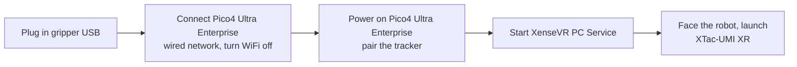

# Quickstart (TL;DR)

Already prepared — device understood, cables in, environment installed? This page
takes you **from power-on to your first episode**, copy-paste as-is. First time
through, do [Getting Ready](hardware.md) first: [Hardware](hardware.md) →
[Installation](02-environment.md) → [Host & Device Setup](03-host-hardware.md),
then come back.

!!! danger "Check your versions first — repo, SDK and firmware must all be current"
    On a mismatched stack, collection **still runs to completion and writes a dataset**; only
    `gripper.pos` ends up on a scale that does not match anyone else's, and nothing in the data
    shows it. One-off upgrade steps → [Required versions](versions.md#required).

!!! note "Prerequisites (Getting Ready)"
    - Device understood, **hardware connected and powered** (see [Hardware](hardware.md#install)).
    - Repo, submodules and **gripper firmware** upgraded per
      [Required versions](versions.md#required). The firmware requirement is **command set
      V2.1** — build **leader >= 1.2.0 / follower >= 1.1.0**, and a higher build is fine
      ([the difference](versions.md#v21)).
    - [Installation](02-environment.md) done — either path, with all three SDK packages importing.
    - [Serial permissions + ModemManager](03-host-hardware.md#31) one-off host setup done.
    - **Bimanual rigs**: the [USB bandwidth budget](03-host-hardware.md#usb-budget) has been checked
      — six cameras on one bus is how a camera ends up refusing to open.
    - Every leader gripper has been through [gripper calibration](04-calibration.md#41) (zero +
      travel span, once per unit). **An uncalibrated leader is refused at connect.** Calibrate
      both sides of a bimanual rig — doing one leaves the two channels on different scales.
    - You are inside the collection environment: `mamba activate xense-taccap` on the Mamba
      path, or `docker compose run --rm xense-taccap` on the Docker one.

## 1. Power-on order



```bash
/opt/apps/roboticsservice/runService.sh    # start it before opening the app
```

!!! warning "Service first, then the app"
    The app connects to this service. With it down, the app just sits on "Not connected".

!!! danger "On the wired link, turn the host's WiFi off"
    The Pico4 Ultra Enterprise uses a **wired shared network**. Host WiFi conflicts with it and
    makes tracking unstable or unreachable. Turn WiFi off on the collection host for the whole
    session. See [3.4 Network](03-host-hardware.md#pico-network).

!!! warning "Never restart XTac-UMI XR mid-session"
    Restarting resets the world origin, which leaves poses inside one dataset referenced to
    different frames.

## 2. Self-check (devices ready)

```bash
# Grippers readable: role should be Leader/Follower, firmware_sn non-empty
python -c "from xense.taccap import scan_grippers
for g in scan_grippers(): print(g.side.name, g.role.name, repr(g.firmware_sn))"
```

Anything wrong → [Troubleshooting](troubleshooting.md).

## 3. Preview the live streams

Before recording, open Rerun with `lerobot-teleoperate` and confirm the streams. **Three stages**,
each adding a layer of hardware — **preview at whichever stage you intend to record at**.

=== "1. Gripper only"

    Both tactile streams, the wrist camera and `gripper.pos`. Tracker and headset off, so this
    **does not need the PC Service running**.

    This is the stage to **get a feel for the tactile sensors**: press a finger against either
    visuotactile pad and its texture in Rerun deforms visibly with the pressure, springing back
    when you let go. Work the jaw and watch `gripper.pos` reach **1.0** open and **0.0** closed.

    ```bash
    lerobot-teleoperate \
        --robot.type=bi_taccap_gripper \
        --robot.id=0 \
        --robot.enable_tracker=false \
        --robot.enable_head_camera=false \
        --fps=30 \
        --display_data=true
    ```

=== "2. Add the tracker pose"

    Rerun gains the `/world` 3D view: the gripper's EE marker and the **trail** it has travelled.

    **Put the tracker in the headset's field of view before starting.** Standalone tracking works
    by the headset seeing the tracker, so anything blocking it — your body, the desk edge, your
    other hand — loses tracking, which shows up as pose jumps or a frozen pose (see
    [binding the tracker](03-host-hardware.md#pico-tracker-bind)).

    It also needs the tracker powered on, the Pico4 connected and the
    [XenseVR PC Service](03-host-hardware.md#35) running.

    ```bash
    lerobot-teleoperate \
        --robot.type=bi_taccap_gripper \
        --robot.id=0 \
        --robot.enable_tracker=true \
        --robot.enable_head_camera=false \
        --fps=30 \
        --display_data=true
    ```

=== "3. Everything, headset camera included"

    Adds the headset's stereo view and the head pose. Needs **PC Service >= v0.2.0**
    → [5.6 Headset camera](05-data-collection.md#56).

    ```bash
    lerobot-teleoperate \
        --robot.type=bi_taccap_gripper \
        --robot.id=0 \
        --robot.enable_tracker=true \
        --robot.enable_head_camera=true \
        --fps=30 \
        --display_data=true
    ```

**Single gripper**: swap `--robot.type` for `taccap_gripper` and add
`--robot.side=left|right`; everything else is the same.

Move the gripper and work the jaw to check every stream. `Ctrl+C` to leave the preview. Preview at
whichever stage matches the recording you are about to make.

!!! tip "Check `gripper.pos` here, not after recording"
    In the scalar panel, a fully open jaw should read **1.0** and fully closed **0.0**. Topping
    out below 1.0 (e.g. 0.68) means that unit's travel span was never calibrated — see
    [4.1 Gripper calibration](04-calibration.md#41). Nothing downstream will flag this for you.

## 4. Record one episode

**Match the stage you just previewed** — the three produce different datasets:

=== "1. Gripper only"

    Writes `gripper.pos`, both tactile streams and the wrist camera. **No pose** — the dataset
    has no `tcp.*` at all.

    ```bash
    lerobot-record \
        --robot.type=bi_taccap_gripper \
        --robot.id=0 \
        --robot.enable_tracker=false \
        --robot.enable_head_camera=false \
        --display_data=false \
        --dataset.repo_id=<your_org>/<dataset_name> \
        --dataset.num_episodes=1 \
        --dataset.fps=30 \
        --dataset.push_to_hub=false \
        --dataset.episode_time_s=120 \
        --dataset.reset_time_s=60 \
        --dataset.single_task='Pick up the object'
    ```

=== "2. Add the tracker pose"

    Adds the EEF pose `tcp.*`. **This is the standard collection setup** — what you want almost every time.

    ```bash
    lerobot-record \
        --robot.type=bi_taccap_gripper \
        --robot.id=0 \
        --robot.enable_tracker=true \
        --robot.enable_head_camera=false \
        --display_data=false \
        --dataset.repo_id=<your_org>/<dataset_name> \
        --dataset.num_episodes=1 \
        --dataset.fps=30 \
        --dataset.push_to_hub=false \
        --dataset.episode_time_s=120 \
        --dataset.reset_time_s=60 \
        --dataset.single_task='Pick up the object'
    ```

=== "3. Everything, headset camera included"

    Adds the headset's stereo view as `left_head` / `right_head` and the head pose
    `head_camera.*` (see [§5.6](05-data-collection.md#56)). Expect noticeably more video.

    ```bash
    lerobot-record \
        --robot.type=bi_taccap_gripper \
        --robot.id=0 \
        --robot.enable_tracker=true \
        --robot.enable_head_camera=true \
        --display_data=false \
        --dataset.repo_id=<your_org>/<dataset_name> \
        --dataset.num_episodes=1 \
        --dataset.fps=30 \
        --dataset.push_to_hub=false \
        --dataset.episode_time_s=120 \
        --dataset.reset_time_s=60 \
        --dataset.single_task='Pick up the object'
    ```

**Single gripper**: `--robot.type=taccap_gripper`; everything else is the same. Add
`--robot.side=left|right` only when both grippers are plugged in.

A few that are easy to get wrong:

- `--robot.id` is **required** — the station number for this rig, and **a bare number is what you
  pass** (`0`, `1`, …; one per rig, and a bimanual rig is one rig). Leaving it out fails at
  CLI-parse time. The prefix comes from `--robot.type`: `0` is stored as `taccap_0` on a single rig
  and `bi_taccap_0` on a bimanual one →
  [`--robot.id` and the hardware manifest](05-data-collection.md#robot-id).
- `--robot.side` is only needed in single-gripper mode with **both grippers plugged in**; a lone unit auto-resolves.
- `--fps` is the main loop rate, `--dataset.fps` is the recording sample rate — **two parameters**,
  usually set to the same value.
- `--robot.enable_tracker` and `--robot.enable_head_camera` are spelled out so they match the preview stage you just ran — record at the stage you previewed.
- `--display_data` is **on to preview, off to record**: Rerun's display costs frame budget on the
  collection loop.

Every parameter (dataset / recording control / device) → [5.2 Parameter reference](05-data-collection.md#params)

## 5. Check the local dataset

Use the same `repo_id` you recorded with to verify the local dataset's structure and contents.

```bash
lerobot-check-dataset --repo-id <your_org>/<dataset_name>
```

## 6. (Optional) Push to the Hub

```bash
lerobot-push-dataset-to-hub \
    --repo-id <your_org>/<dataset_name> \
    --dataset-path ~/.cache/huggingface/lerobot/<your_org>/<dataset_name> \
    --upload-large-folder
```

What the dataset looks like and what each frame holds → [Dataset & examples](06-dataset.md).
