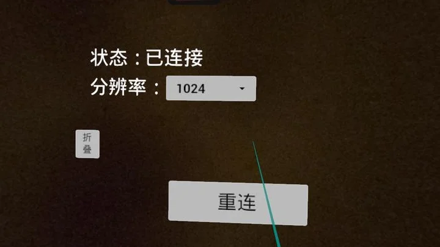

# Quickstart (TL;DR)

From power-on to your first recorded episode. Before you start, make sure these five are done:

- Hardware connected → [Hardware](hardware.md#install)
- Environment installed and active (`mamba activate xense-taccap` or the Docker container) → [Installation](02-environment.md)
- Host configured: serial permissions, ModemManager kept off the ports → [Host & Device Setup](03-host-hardware.md#31)
- Every leader gripper calibrated (an uncalibrated leader is refused) → [Gripper calibration](04-calibration.md#41)
- Repo, SDK and gripper firmware all up to date → [Required versions](versions.md#required)

## 1. Power on and connect

1. Plug in the gripper USB.
2. Wire the headset network and **turn off the PC's WiFi**.
3. Turn on the headset and short-press the tracker power button until the LED is solid blue.
4. Start the XenseVR PC Service: `/opt/apps/roboticsservice/runService.sh`
5. **Facing the robot**, open XTac-UMI XR and tap Reconnect until it shows Connected.

<div class="tc-pair" markdown>

<figure class="tc-shot" markdown>

<figcaption>The gripper connects to the PC over USB Type-C</figcaption>
</figure>

<figure class="tc-shot" markdown>

<figcaption>XTac-UMI XR shows Connected</figcaption>
</figure>

</div>

!!! warning "Three common mistakes"
    - Start the PC Service before opening the XR app, or the app stays Disconnected.
    - With a wired headset the PC's WiFi must be off, or tracking is unstable. See [Network](03-host-hardware.md#pico-network).
    - Do not restart the XR app during collection: it resets the world origin, so poses within one dataset stop lining up.

## 2. Self-check

```bash
python -c "from xense.taccap import scan_grippers
for g in scan_grippers(): print(g.side.name, g.role.name, repr(g.firmware_sn))"
```

One line per gripper, `role` is `Leader` or `Follower`, and the serial is not empty. If not, see [Troubleshooting](troubleshooting.md).

## 3. Preview check

```bash
lerobot-teleoperate \
    --robot.type=bi_taccap_gripper \
    --robot.id=0 \
    --robot.enable_tracker=true \
    --robot.enable_head_camera=false \
    --fps=30 \
    --display_data=true
```

<figure class="tc-shot" markdown>

<figcaption>Move and open/close the grippers, check that every image, tactile stream and pose updates, then press Ctrl+C</figcaption>
</figure>

That is the standard setup (with tracker pose). The tiers differ only in `--robot.enable_tracker` and `--robot.enable_head_camera`; **record with the same tier you previewed**:

| Tier | Tracker | Headset camera | Data included |
|---|---|---|---|
| ① Grippers only | `false` | `false` | Tactile, wrist cameras, gripper opening; no PC Service needed |
| ② Plus tracker (standard) | `true` | `false` | Adds the gripper pose `tcp.*` |
| ③ Everything | `true` | `true` | Adds headset stereo images and head pose; needs PC Service ≥ v0.2.0 |

Keep the trackers in the headset's view before starting; occlusion loses tracking.

## 4. Full recording

```bash
lerobot-record \
    --robot.type=bi_taccap_gripper \
    --robot.id=0 \
    --robot.enable_tracker=true \
    --robot.enable_head_camera=false \
    --dataset.repo_id=<your_org>/<dataset_name> \
    --dataset.single_task='Pick up the object' \
    --dataset.num_episodes=1 \
    --dataset.fps=30 \
    --dataset.episode_time_s=120 \
    --dataset.reset_time_s=60 \
    --dataset.push_to_hub=false
```

<figure class="tc-shot tc-shot--narrow" markdown>

<figcaption>With everything on, the eight streams recorded every frame and their keys in the dataset</figcaption>
</figure>

- `--robot.id` is required: the station number as a plain number (`0`, `1`, …), one per kit.
- Keep the two `enable_*` switches the same as in the preview; see the table above.
- Single gripper: `--robot.type=taccap_gripper`; with both grippers plugged in, add `--robot.side=left` or `right`.

All parameters: [Recording parameters](05-data-collection.md#params).

## 5. Check and upload

Check the dataset:

```bash
lerobot-check-dataset --repo-id <your_org>/<dataset_name>
```

Upload to the Hugging Face Hub when needed:

```bash
lerobot-push-dataset-to-hub \
    --repo-id <your_org>/<dataset_name> \
    --dataset-path ~/.cache/huggingface/lerobot/<your_org>/<dataset_name> \
    --upload-large-folder
```

Dataset layout and fields: [Dataset & Examples](06-dataset.md).
