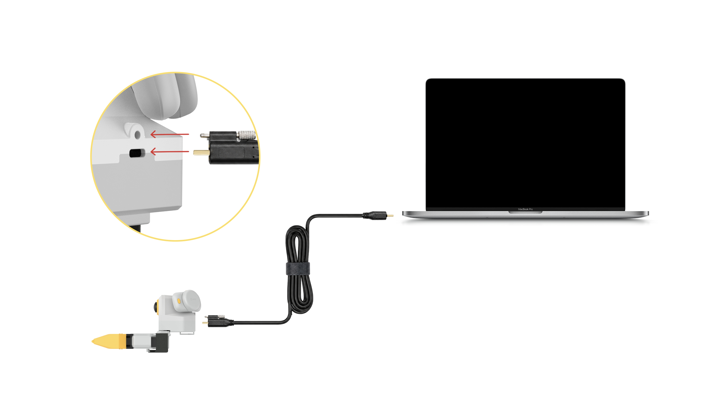
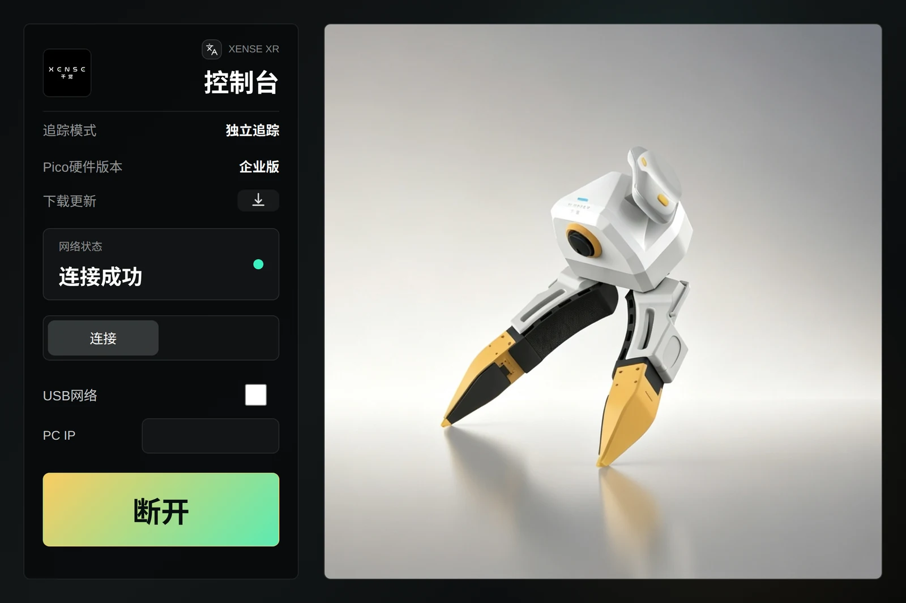
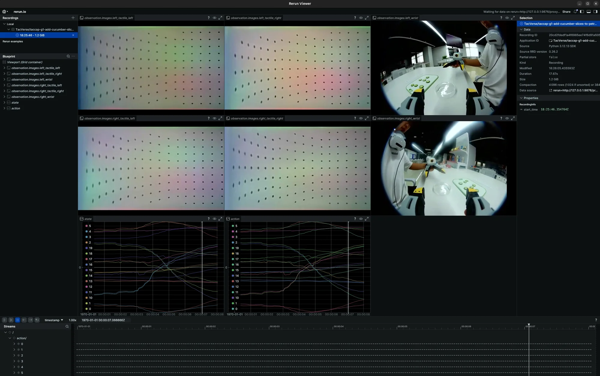
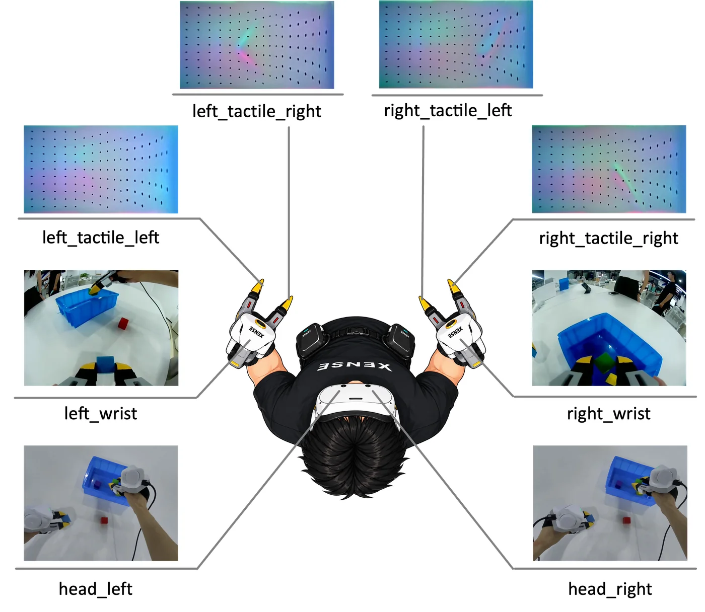

# 一页速通（TL;DR）

从上电到录出第一条数据，照着做即可。开始前确认这五项都已完成：

- 硬件已接好 → [硬件介绍](hardware.md#install)
- 环境已安装，已进入采集环境（`mamba activate xense-taccap` 或 Docker 容器） → [环境安装](02-environment.md)
- 主机已配置串口权限并关闭 ModemManager 抢占 → [主机与设备配置](03-host-hardware.md#31)
- 每只主夹爪已标定（没标定会被拒绝连接） → [夹爪标定](04-calibration.md#41)
- 仓库、SDK 与夹爪固件都是最新版本 → [必须升级到最新版本](versions.md#required)

## 1. 上电与连接

1. 插上夹爪 USB。
2. 头显接上有线网络，**关闭电脑 WiFi**。
3. 打开头显，短按追踪器电源键至蓝灯亮起。
4. 启动 XenseVR PC Service：`/opt/apps/roboticsservice/runService.sh`
5. **面朝机器人**打开 XTac-UMI XR，点「连接」，网络状态变为「连接成功」。

<div class="tc-pair" markdown>

<figure class="tc-shot" markdown>

<figcaption>夹爪经 USB Type-C 连接电脑</figcaption>
</figure>

<figure class="tc-shot" markdown>

<figcaption>XTac-UMI XR 网络状态变为「连接成功」</figcaption>
</figure>

</div>

!!! warning "三个容易出错的地方"
    - 先启动 PC Service，再打开 XR 应用，否则连不上。
    - 头显走有线时必须关闭电脑 WiFi，否则追踪不稳。见 [网络连接](03-host-hardware.md#pico-network)。
    - 采集期间不要重启 XR 应用：重启会重设世界原点，同一数据集里的位姿就对不上了。

## 2. 自检

```bash
python -c "from xense.taccap import scan_grippers
for g in scan_grippers(): print(g.side.name, g.role.name, repr(g.firmware_sn))"
```

每只夹爪一行，`role` 为 `Leader` 或 `Follower`，序列号不为空。出问题见 [故障排查](troubleshooting.md)。

## 3. 预览检查

```bash
lerobot-teleoperate \
    --robot.type=bi_taccap_gripper \
    --robot.id=0 \
    --fps=30 \
    --display_data=true
```

<figure class="tc-shot" markdown>

<figcaption>移动、开合夹爪，确认各路画面、触觉和位姿都在更新，然后按 Ctrl+C 退出</figcaption>
</figure>

上面是标准配置：双夹爪加追踪器位姿。三档用 `--robot.type` 区分，**预览用哪一档，录制就用哪一档**：

| 档位 | 写法 | 包含的数据 |
|---|---|---|
| ① 只有夹爪 | `--robot.type=bi_taccap_gripper --robot.enable_tracker=false` | 触觉、腕部相机、开合度；不需要 PC Service |
| ② 加追踪器（标准） | `--robot.type=bi_taccap_gripper` | 再加夹爪位姿 `tcp.*` |
| ③ 加头显 | `--robot.type=xtac_umi_g1` | 再加头显双目画面与头部位姿 |

启动前把追踪器放在头显视野内，被遮挡会丢跟踪。

## 4. 正式录制

```bash
lerobot-record \
    --robot.type=bi_taccap_gripper \
    --robot.id=0 \
    --dataset.repo_id=<你的org>/<数据集名> \
    --dataset.single_task='Pick up the object' \
    --dataset.num_episodes=1 \
    --dataset.fps=30 \
    --dataset.episode_time_s=120 \
    --dataset.reset_time_s=60 \
    --dataset.push_to_hub=false
```

<figure class="tc-shot tc-shot--narrow" markdown>

<figcaption>使用 `xtac_umi_g1` 时每一帧记录的八路画面及其在数据集里的键名</figcaption>
</figure>

- `--robot.id` 必填，直接填工位号数字（`0`、`1`…），一套设备一个。
- `--robot.type`（以及是否加 `--robot.enable_tracker=false`）与预览时保持一致，见上一步的表格。
- 单夹爪：`--robot.type=taccap_gripper`，两只夹爪都接着时再加 `--robot.side=left` 或 `right`。

全部参数见 [录制参数](05-data-collection.md#params)。

## 5. 检查与上传

检查数据集完整性：

```bash
lerobot-check-dataset --repo-id <你的org>/<数据集名>
```

需要时上传到 Hugging Face Hub：

```bash
lerobot-push-dataset-to-hub \
    --repo-id <你的org>/<数据集名> \
    --dataset-path ~/.cache/huggingface/lerobot/<你的org>/<数据集名> \
    --upload-large-folder
```

数据集的结构与字段见 [数据集与示例](06-dataset.md)。
