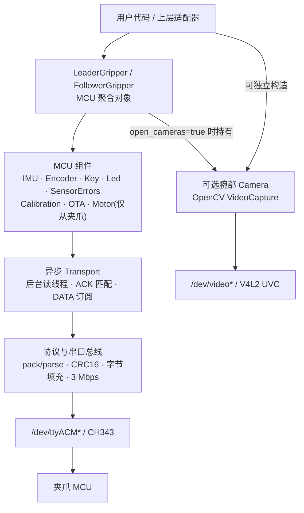

# SDK 概览

`xense.taccap`(`taccap-gripper` SDK)是 XTac-UMI G1 的 **C++17 / Python 设备访问层**,
统一命名空间 `xense::taccap::` / `xense.taccap`。数采主仓库通过
`third_party/taccap-gripper` 子模块消费它,不重复实现底层通信。

!!! info "版本基线"
    本附录按 `taccap-gripper 0.1.9` 源码核对(与[版本与支持](versions.md)里的已验证基线一致)。
    SDK 升级后应同步复核接口、构建选项与示例命令。

!!! note "能力边界"
    - SDK 通过串口协议访问夹爪 MCU,提供 IMU、编码器、按键、LED、传感器错误、标定、OTA,
      以及仅从夹爪具备的电机控制。
    - SDK 也提供独立、可选的腕部 UVC `Camera` 类;`LeaderGripper.open()` / `FollowerGripper.open()` 默认不打开相机,只有显式设置 `open_cameras=true` 并提供设备路径时聚合对象才会持有它。
    - `xense-taccap-lerobot` 的正式数采路径不使用该 SDK `Camera`,而是直接使用 LeRobot `OpenCVCamera`;视触觉图像由 `XenseTactileCamera` + `xensesdk` 采集。

## 分层架构

| 层 / 组件 | 职责 |
|---|---|
| **聚合对象** | `LeaderGripper` / `FollowerGripper` 管理 MCU Transport 与组件生命周期;`open()` 只适用于当前恰好连接一只夹爪的场景,多设备时应先扫描端点再显式构造 |
| **MCU 组件** | `IMU` / `Encoder` 使用 `read_once()` 同步读取、`on_data(cb)` 订阅流数据;`Led`(V1.9)、`SensorErrors`(V1.6)、`OtaSession`(V1.3)两侧都有;`Motor` **仅从夹爪** |
| **`Calibration`** | V2.0/V2.1,两侧都有。鱼眼相机标定 `read_fisheye()` / `write_fisheye()` 双侧可用;**行程上限** `read_encoder_max_rad()` / `write_encoder_max_rad()` **仅主夹爪**,从夹爪 NACK。从未写入过的记录返回空 `optional` / Python `None`,以区别于"标定值恰好为 0" |
| **归一化位置** | 两侧都有。从夹爪来自 `GripperConfig`;主夹爪自 0.1.7 起由行程上限标定得到——`EncoderSample.position` 给出 `[0,1]` 开度,需 `LeaderGripper::Config::normalize_position`(或用 `encoder_max_rad` 由主机侧指定,用于 V2.1 以前的固件) |
| **Camera** | 独立 OpenCV/V4L2 采集路径,使用 `read()` 或 `start(callback)` / `stop()`,不经过串口 Transport |
| **Transport** | 后台串口读线程、ACK 匹配(seq→promise)、按命令分发 DATA |
| **协议 / 总线** | 帧打包解析、CRC16、字节填充、`SerialBus`(termios @ 3 Mbps) |

## 两个可消费面

| 产物 | 用途 |
|---|---|
| `taccap_core` CMake target / `libtaccap_core.so` | 通过源码 `add_subdirectory()` 集成进 ROS2 或其他 CMake 工程 |
| `xense.taccap`(Python 扩展) | 数采脚本、Jupyter、上层产品(本手册主用) |

二者由**同一套顶层 CMake** 构建。当前 C++ 面没有独立的 install/export package,应通过源码子目录消费;Python 面由本地源码构建 wheel / editable install。详见 [安装与构建](sdk-install.md)。

## 线程模型

- 回调在**生产者线程**(读线程 / 采集线程)触发。
- Python 回调重新获取 GIL;回调内异常经 `discard_as_unraisable` 上报,不会拖垮生产者。
- `LeaderGripper` 与 `FollowerGripper` 不可拷贝/移动;C++ `open()` 返回 `unique_ptr`,析构时执行尽力而为的 `stop_streaming()`。

## 不属于本 SDK 的部分

数据集录制、时间对齐、分集、ROS2 节点、lerobot Robot 适配、上层遥操/回放,都在**各自的
上层仓库**实现(如本手册对应的 `xense-taccap-lerobot`)。保持 SDK 精简,便于各消费方按需取用。
