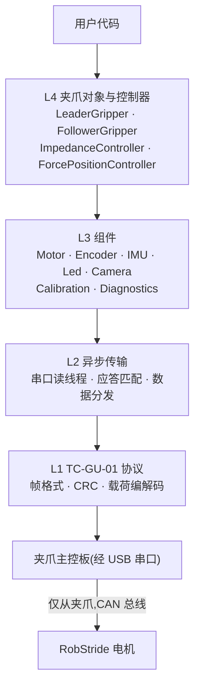

# SDK 概览

`xense.taccap`(仓库 [TacCap-Gripper](https://github.com/XenseRobotics-AI/TacCap-Gripper))是 XTac-UMI G1
夹爪的设备访问层:C++17 实现,Python 通过绑定调用同一份代码。C++ 命名空间是 `xense::taccap::`,
Python 包名是 `xense.taccap`。主夹爪的读取、从夹爪的控制、固件升级、标定记录都经由它完成。

!!! warning "本附录按 SDK 0.3.2 编写"
    本附录的接口、命令与报错原文按 TacCap-Gripper **v0.3.2** 核对,对应随包固件主夹爪 1.2.5、从夹爪 1.2.9。

    数采仓库 `xense-taccap-lerobot` 通过子模块自带的 SDK 仍是 **0.1.9 系列**,两者接口差别很大,
    差异见 [示例 → 从旧版本迁移](sdk-examples.md#migrate)。数采照 [环境安装](02-environment.md) 走即可;
    需要自己写程序调用 SDK,或者使用[从夹爪](follower-overview.md),按 [安装与构建](sdk-install.md) 单独安装 0.3.2,不要和数采环境混用。

## 能做什么 {#scope}

- **设备发现**:按固件烧录的序列号找到每只夹爪,识别左右与主从。
- **主夹爪**:读编码器(开合角)、IMU、按键;归一化开度 `[0, 1]`。
- **从夹爪**:两种控制器驱动电机——`ForcePositionController` 夹持,`ImpedanceController` 跟随位置;
  读电机状态;配置运动安全包络;记录电机型号。
- **两种夹爪都有**:LED、腕部相机(可选)与鱼眼内参、固件诊断计数、固件 OTA。
- **从夹爪独有**:经夹爪 USB-C 升级电机固件。

**不在 SDK 里的**:视触觉传感器图像由 `xensesdk` 采集;遥操作、抓取策略、数据集录制与回放
属于上层应用(如数采仓库 `xense-taccap-lerobot`)。SDK 只提供实时的设备接口,不提供策略。

## 分层结构 {#layers}

```mermaid
flowchart TB
    U["用户代码"] --> L4["L4 夹爪对象与控制器<br/>LeaderGripper · FollowerGripper<br/>ImpedanceController · ForcePositionController"]
    L4 --> L3["L3 组件<br/>Motor · Encoder · IMU · Led · Camera<br/>Calibration · Diagnostics"]
    L3 --> L2["L2 异步传输<br/>串口读线程 · 应答匹配 · 数据分发"]
    L2 --> L1["L1 TC-GU-01 协议<br/>帧格式 · CRC · 载荷编解码"]
    L1 --> MCU["夹爪主控板(经 USB 串口)"]
    MCU -->|仅从夹爪,CAN 总线| MOTOR["RobStride 电机"]
```

电脑从不直接和电机通信:所有电机命令都发给夹爪主控板,由它转发给电机。所以主控板上的
保护(运动安全包络、堵转判定)是任何程序都绕不过去的一层。

一般只需要用到 L4 和 L3。L1、L2 面向调试协议本身,本附录不展开。

## 主夹爪与从夹爪的接口差异 {#leader-vs-follower}

| | `LeaderGripper` | `FollowerGripper` |
|---|---|---|
| 开合量 | 编码器,`g.encoder`;`normalize_position=True` 时样本带 `[0,1]` 开度 | 电机位置,`g.position()` 或控制器 `snapshot()` |
| 数据流 | `start_streaming(imu_hz, encoder_hz)` | `start_streaming(motor_hz=100)`,只有电机状态 |
| IMU / 编码器 / 按键 | 有 | 无,读取报 `InvalidCmd` |
| 电机与控制器 | 无 | `g.motor`、两种控制器 |
| 行程标定 | 手动,`calibrate.py`;行程上限存在夹爪里 | 上电自动标定 |
| 运动安全包络 | 无 | `audit_envelope()` / `ensure_envelope()` |
| 固件版本门槛 | 无 | 低于 1.2.5 拒绝打开 |
| `position_map` | 属性 | 方法 `position_map()` |

两类都支持:`g.led`、`g.calibration`(鱼眼内参)、`g.diagnostics`、`g.firmware_version`、腕部相机。

## 线程与生命周期 {#threads}

- 每只夹爪有自己的串口读线程和回调分发线程。**回调在分发线程上执行**,不会阻塞串口读取;
  但回调里做重活会让后续数据排队,尽量只做拷贝和入队。
- Python 回调执行时会持有 GIL;回调里抛出的异常只记录日志,不会让 SDK 线程退出。
- 控制器另有一个线程,每收到一帧电机状态就下发一帧命令,正好落在主控板空闲的时间窗里。
- 夹爪对象不能复制。Python 用 `with t.FollowerGripper(...) as g:` 管理生命周期,退出时停止数据流并关闭串口;
  **它不会让电机失能**,电机失能由控制器的 `stop()` 负责。
- 两只夹爪各用各的对象、各起各的控制器,互不影响;一只夹爪上只能有一个控制器。

## 日志 {#logging}

SDK 用同一个名为 `xense.taccap` 的日志器,C++ 和 Python 共用:

- 终端输出默认 `INFO` 级别,Python 里用 `from xense.taccap import log; log.set_level("warn")` 调整。
- 同时写文件日志,固定 `DEBUG` 级别:目录为 `$TACCAP_LOG_DIR`,未设置时为 `~/.taccaplogs/`,
  每个进程一份 `session_YYYYMMDD_HHMMSS.log`。反馈问题时附上对应的日志文件。

## 本附录的其他页 {#pages}

- [安装与构建](sdk-install.md):Python 安装、仅 C++ 构建、集成到 CMake / ROS 2 工程。
- [API 要点](sdk-api.md):设备发现、主夹爪读取、从夹爪控制、电机底层原语、标定记录与鱼眼回退、LED 与诊断。
- [示例](sdk-examples.md):全部示例脚本、C++ 示例,以及从旧版本迁移的对照表。
